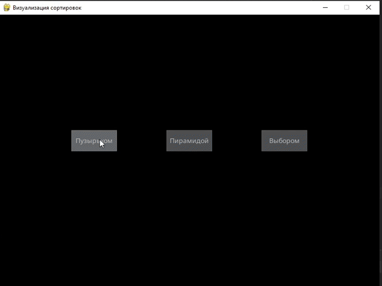

 # Визуализация алгоритмов сортировки
 
Этот проект представляет собой инструмент визуализации различных алгоритмов сортировки на языке Python. Приложение позволяет пользователям увидеть, как работают разные алгоритмы сортировки в реальном времени, что делает его полезным как для обучения, так и для развлечения.

## Возможности

- **Визуализация в реальном времени**: Наблюдайте, как различные алгоритмы сортировки обрабатывают и сортируют данные шаг за шагом.
- **Поддерживаемые алгоритмы сортировки**:
  - Пузырьковая сортировка
  - Сортировка выбором
  - Пирамидальная (кучей) сортировка
- **Настраиваемые параметры**: Регулируйте скорость визуализации и количество элементов для сортировки.

## Можно выбрать какую из визуализаций посмотреть:

# Сортировка выбором

# Сопртировка пузырьком

# Сортировка кучей (Пирамидальная сортировка)

